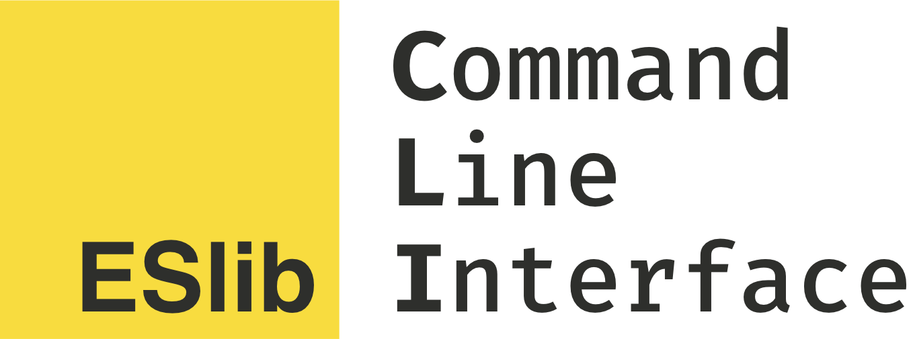

[![Build Status][build]](https://circleci.com/gh/eslib/cli) [![npm]](https://www.npmjs.com/package/@eslib/cli) [![mit]](https://opensource.org/licenses/MIT)

[build]: https://img.shields.io/circleci/project/eslib/cli.svg?branch=master&style=flat-square
[npm]: https://img.shields.io/npm/v/@eslib/cli.svg?style=flat-square
[mit]: https://img.shields.io/npm/l/@eslib/cli.svg?style=flat-square

> Safe, extensible prototypes for TypeScript and JavaScript

**Work in progress.**

## Example

```sh
npm install @eslib/cli -S
./node_modules/.bin/eslibcheck
```

## Tests

```sh
npm test
```

## License

MIT
